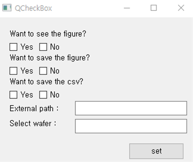

# Introduction
PE2-Project

A1 김동구, 김민재, 박찬근

* Our program was developed to data analyze measured data.
    * Parse xml files that containing raw data.
    * Plot raw data and processed data.
    * Save the results as csv and image files

# Installation
1. This program requires several libraries.(Basically, interpreter anaconda or miniconda is needed.)
    * So, enter the ***'Terminal'*** and type as follows.
    * ***pip install -r requirements.txt***
    * This command will install all necessary libraries.
2. The ***src folder*** must be specified as the ***sources root***.
    * Right-click on the ***src folder*** on the left
    * Go to ***Mark directory as*** and select ***sources root***.
3. Now, the program is ready to use.

# How to make it work
## WARNING !!!
***When you run the program, all files in the result folder are deleted, so make sure to back up if they are important.***

1. Run the run.py it appears that these checkbox.
2. Select the desired option and click the set button to launch the program.
    * At this point, enter the path in the textbox where the data file is in the outer path, and leave it blank if not.
    * Likewise, enter a wafer to analyze. And leave blank if you want to analyze all wafers.
    ex) D07,D08 (with no blank only comma(,))

# After running
1. Click on the link below to check the report.

[report](https://github.com/PE2-Project/project/blob/main/doc/report.ipynb)
